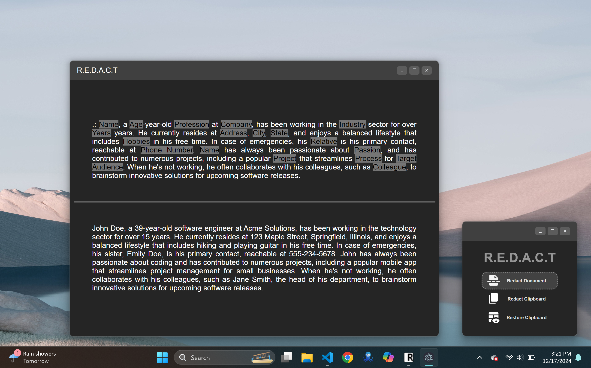

# ✂️ R.E.D.A.C.T V2
**Restricting Exposed Data by Anonymization for Confidential Transmission**

🔐 An Electron-based desktop app to **redact sensitive PII** from text documents and clipboard content using the **Hugging Face Inference API**, with a preview and restore-friendly workflow.

---

## 🚀 Features

- 🧠 Redacts PII using Hugging Face's `dslim/bert-base-NER` model (NER-based)
- ✍️ Inline editing of redacted content
- 📋 Clipboard redaction/restoration with one click
- 📂 Drag-and-drop file support for `.txt`, `.pdf`, `.doc`, `.docx`
- 🔔 Popup alerts and feedback
- 📄 Generates `-REDACTED` clones while preserving original format

---

## 🖼️ Preview



---

## 🛠️ Installation

1. **Clone the Repository**  
   ```bash
   git clone https://github.com/KarthikBalaji-007/REDACT V2.git
   cd Freshathon
   ```

2. **Install Dependencies**  
   ```bash
   npm install
   ```

3. **Configure Hugging Face API**  
   - Create a `.env` file in the root folder  
   - Add your API key like this:  
     ```env
     HUGGINGFACE_API_KEY=your_api_key_here
     ```

4. **Run the App**  
   ```bash
   npm start
   ```

---

## 🧑‍💻 Usage

### 📋 Redact Clipboard Content
Click `Redact Clipboard` → Detected PII is replaced with tags → Displayed in new window

### ♻️ Restore Clipboard Content
Click `Restore Clipboard` → Original content restored from mapping → Displayed in new window

### 📄 Redact a Document
Drag-and-drop `.txt`, `.pdf`, `.doc`, or `.docx` → Redacted version shown → Saved with `-REDACTED` suffix

### ✏️ Edit Redacted Text
Click on redacted tags to manually edit or restore

---

## ⚠️ Note on Accuracy

This app uses the `dslim/bert-base-NER` model from Hugging Face’s Inference API for redaction.  
It offers good baseline coverage but may occasionally miss certain entities.  
Always **review output** before sharing externally.

---

## 📁 Examples

Check the `examples/` folder for sample input/output:

- `example_data.txt` – Sample input text  
- `example_data.txt-REDACTED.txt` – Redacted version  
- `example_data.pdf` – Sample PDF  
- `example_data.pdf-REDACTED.txt` – Redacted output in plain text

---

## 📜 License

[MIT License](LICENSE)

---

🌟 Feel free to fork, star, and contribute to make **R.E.D.A.C.T.** even better!
